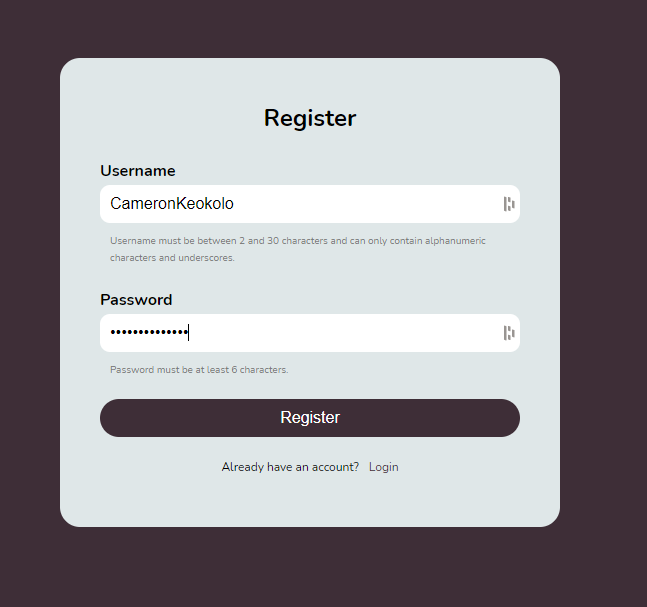
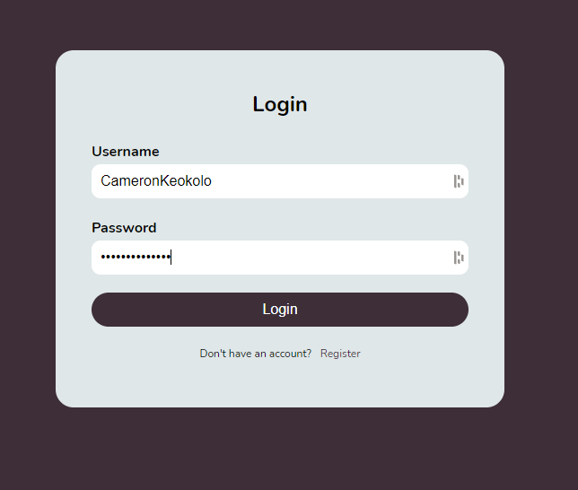
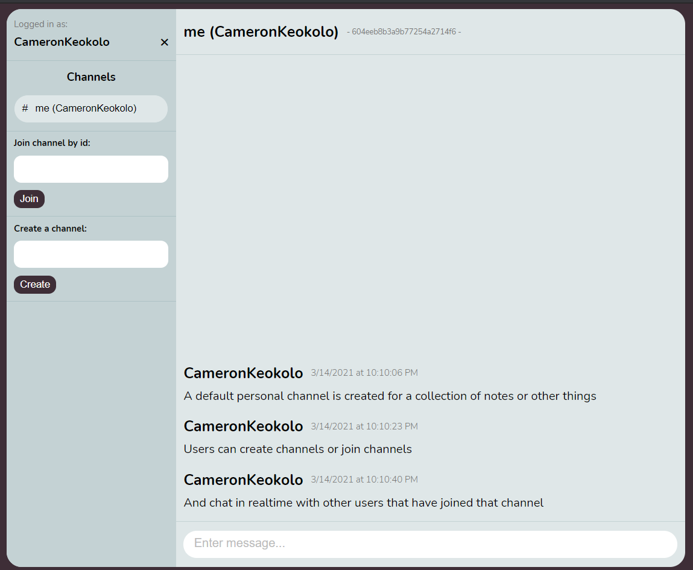
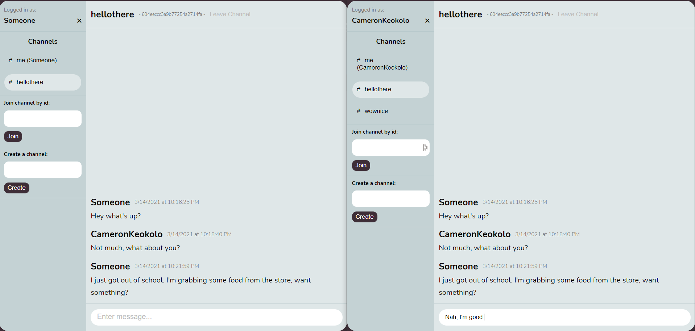

# Realtime Chat App
An example real-time chat application that lets users create an account, join channels, and send messages.

### Tech Stack
* React
* Nodejs + Express
* MongoDB
* Socket.io

## Screenshots

### Register

### Login

### App - Personal Channel

### App - Realtime Chat
